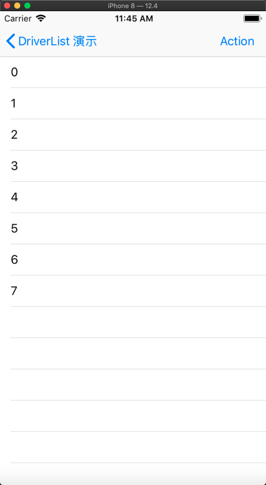
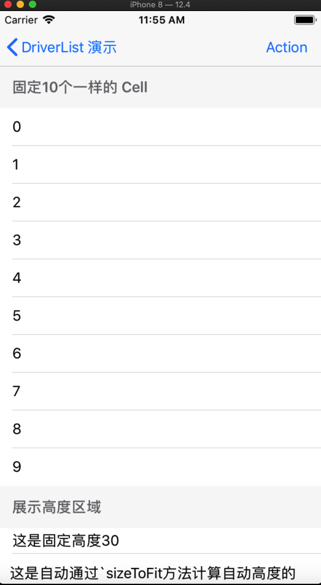
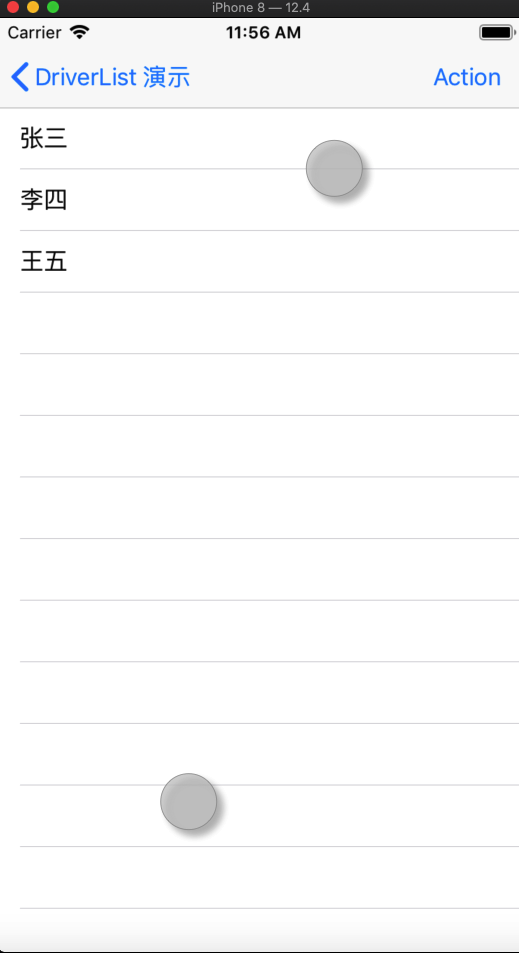

---
filename:images
---


## Swift 版本请移步[这里](https://github.com/josercc/SwiftTableViewGroup)

###  DriverListNode为 UITableView和 UICollectionView 而生

> `ZHTableViewGroup`已经更名为`DriverListNode`

## 演示

### 简单的 UITableView



```objc
NSUInteger count = arc4random() % 10 + 1;
    tableView.driverData(MakeDriverGroup {
        list.makeGroup(MakeDriverNode {
            group.makeCell(ZHDriverNode(MakeDriverBlock(UITableViewCell) {
                [content setConfigBlock:^(UITableViewCell * _Nonnull view, NSUInteger index) {
                    view.textLabel.text = [@(index) stringValue];
                }];
            }))
            .number(count)
            .height(44);
        });
    });
```

### 复杂的 UITableView




```objc
tableView.driverData(MakeDriverGroup {
        list.makeGroup(MakeDriverNode {
            group.makeHeader(ZHDriverNode(MakeDriverBlock(UITableViewHeaderFooterView) {
                [content setConfigBlock:^(UITableViewHeaderFooterView * _Nonnull view, NSUInteger index) {
                    view.textLabel.text = @"固定10个一样的 Cell";
                }];
            }))
            .height(49);
            
            group.makeCell(ZHDriverNode(MakeDriverBlock(UITableViewCell) {
                [content setConfigBlock:^(UITableViewCell * _Nonnull view, NSUInteger index) {
                    view.textLabel.text = [@(index) stringValue];
                }];
            }))
            .height(44)
            .number(10);
        });
        
        list.makeGroup(MakeDriverNode {
            group.makeHeader(ZHDriverNode(MakeDriverBlock(UITableViewHeaderFooterView) {
                [content setConfigBlock:^(UITableViewHeaderFooterView * _Nonnull view, NSUInteger index) {
                    view.textLabel.text = @"展示高度区域";
                }];
            }))
            .height(49);
            
            group.makeCell(ZHDriverNode(MakeDriverBlock(UITableViewCell) {
                [content setConfigBlock:^(UITableViewCell * _Nonnull view, NSUInteger index) {
                    view.textLabel.text = @"这是固定高度30";
                }];
            }))
            .height(30);
            
            group.makeCell(ZHDriverNode(MakeDriverBlock(AutomitcHeightCell) {
                [content setConfigBlock:^(AutomitcHeightCell * _Nonnull view, NSUInteger index) {
                    view.multiLineLabel.text = @"这是自动通过`sizeToFit方法计算自动高度的 Cell,会根据我们自己设置的值返回 Cell 的高度。这是自动通过`sizeToFit方法计算自动高度的 Cell,会根据我们自己设置的值返回 Cell 的高度。";
                }];
            }));
            
            group.makeCell(ZHDriverNode(MakeDriverBlock(UITableViewCell) {
                [content setConfigBlock:^(UITableViewCell * _Nonnull view, NSUInteger index) {
                    view.textLabel.text = @"这个是自定义高度100";
                }];
                [content setCustomHeightBlock:^CGFloat(UITableViewCell * _Nonnull view, NSUInteger index) {
                    return 100;
                }];
            }))
            .height(50);
        });
        
        list.makeGroup(MakeDriverNode {
            group.makeHeader(ZHDriverNode(MakeDriverBlock(UITableViewHeaderFooterView) {
                [content setConfigBlock:^(UITableViewHeaderFooterView * _Nonnull view, NSUInteger index) {
                    view.textLabel.text = @"创建间隙";
                }];
            }))
            .height(49);
            
            group.makeSpeacer(UIColor.lightGrayColor);
            
            group.makeFooter(ZHDriverNode(MakeDriverBlock(UITableViewHeaderFooterView) {
                [content setConfigBlock:^(UITableViewHeaderFooterView * _Nonnull view, NSUInteger index) {
                    view.textLabel.text = @"展示创建 Footer";
                }];
            }))
            .height(49);
        });
    });
```

### 可变数据 UITableView



```objc
tableView.driverData(MakeDriverGroup {
        list.makeGroup(MakeDriverNode {
            group.makeCell(ZHDriverNode(MakeDriverBlock(UITableViewCell) {
                [content setConfigBlock:^(UITableViewCell * _Nonnull view, NSUInteger index) {
                    view.textLabel.text = texts[index];
                }];
            }))
            .number(texts.count)
            .height(44);
        });
    });
```

### 简单的 UICollectionView

## 怎么安装

### Cocoapods

```ruby
pod 'DriverListNode'
```

### Carthage

```ruby
github "josercc/ZHTableViewGroup"
```


